<p align="center">
  
</p>

<p align="center">
  <strong>English</strong> | <a href="README_ZH.md">简体中文</a> | <a href="README_JA.md">日本語</a>
</p>

<p align="center">
  <a href="https://github.com/askdkc/dsh-cli/actions/workflows/ci.yml"></a>
  <a href="LICENSE"></a>
  
  <a href="https://github.com/askdkc/dsh-cli/stargazers"></a>
</p>

# dsh-cli

> An interactive terminal UI plugin for DeepSeek Harness. It ships a
> pixel-whale header, live work status, streaming thinking, double-Esc time
> rewind, a context progress bar, and a TPS gauge. It mounts as a pure plugin,
> with no core changes. Install to enable; uninstall leaves no patches behind.

## Highlights

- **Pixel whale pet** — three startup intros, click to wake; freezes after the first task.
- **Terminal-native UI** — streaming Markdown, tool cards, `/` and `@` completion, `#L12-14` ranges, history search, zh/en UI.
- **Images** — Kitty/Sixel thumbnails, centered preview with zoom and pan, paste-time fitting, text fallback.
- **Mermaid diagrams** — ````mermaid ```` fences drawn as Unicode diagrams.
- **Timeline rail** — every turn clickable; timeline / scrollbar / hidden gutter.
- **Live state** — activity animation, context bar, TPS, cache hit rate, effort, tokens, Git and session metadata.
- **One session manager** — `/resume` `/home` `/agentview` `/bg` `⌸`.
- **Session workflow** — `/new` `/compact` `/export` `/btw`, model hot-switch, fork, rewind, vim, fullscreen draft editor.
- **IDE selection channel** — a VS Code selection lands in the prompt.
- **DSH integrations** — presets, skills, MCP, goals, todos, subagents, questionnaires.
- **Provider authentication** — `/auth` connects ChatGPT, Claude, Grok, OpenCode Zen/Go, OrcaRouter, OpenRouter, Nous, and Infron; choose the model separately with `/model`.
- **Extensions** — browser interaction, computer use and more.
- **Built for long sessions** — event-driven projection, virtualization, bounded caches.

Keys and commands: [Interaction and commands](docs/interaction.en.md). Everything else: [documentation index](docs/README.md).

## Preview

<div align="center">
  <picture>
    <source media="(max-width: 640px)" srcset="docs/assets/readme/preview-en-mobile.svg">
    
  </picture>
</div>

## Featured & Listed

The upstream dsh-TUI project was featured by the **DeepSeek Harness official WeChat account** and listed in the
[dshfind](https://dshfind.com/en/plugins/ccch1mneyyy/dsh-TUI) plugin
directory, and ranked **#7 on [GitHub Trending](https://trendshift.io/repositories/146168)
daily** (TypeScript).

<div align="center">
  <table>
    <tr>
      <td align="center" valign="middle" width="50%">
        
        <br>
        <strong>Featured by the official WeChat account</strong>
      </td>
      <td align="center" valign="middle" width="50%">
        <a href="https://dshfind.com/en/plugins/ccch1mneyyy/dsh-TUI"></a>
        <br>
        <strong>Listed in the dshfind directory</strong>
        <br><br>
        <a href="https://trendshift.io/repositories/146168" title="GitHub Trending Daily #7 · TypeScript"></a>
        <br>
        <strong>GitHub Trending Daily #7</strong>
      </td>
    </tr>
  </table>
</div>

## Quick Start

Prerequisites: [Node.js](https://nodejs.org/en) and
[deepseek-harness](https://github.com/deepseek-ai/deepseek-harness), with
`DEEPSEEK_API_KEY` configured.

The primary compatibility target is DSH `0.1.7-rc.2`. This adapter supports its
Shell API, V4 session messages, declarative presets, and profile-backed settings;
older supported hosts retain their compatibility paths. See [configuration](docs/configuration.en.md).

On DSH 0.1.7, `/settings` uses the TUI's actual Loader entry ID, including custom
IDs. It requires matching profile dependencies with `@deepseek-ai/schemastery`
3.18.3 or newer; an incompatible schema stops TUI startup with repair guidance
instead of showing an uneditable settings page. Older hosts keep their legacy settings scope.

Install this fork from source into the `dsh-cli` profile. Use Node
`^22.19 || >=24` and pnpm 11. The final two commands run in a DeepSeek
Harness source checkout whose dependencies are already installed:

```sh
git clone --recurse-submodules https://github.com/askdkc/dsh-cli.git
cd dsh-cli
pnpm install --frozen-lockfile
TMPDIR=/tmp pnpm build

node scripts/with-publish-manifest.mjs npm pack --ignore-scripts
TARBALL="$PWD/askdkc-dsh-cli-$(node -p "require('./package.json').version").tgz"

cd ~/DIR/TO/deepseek-harness
pnpm dsh plugin --profile dsh-cli add "$TARBALL"
pnpm dsh --profile dsh-cli
```

Replace `~/DIR/TO/deepseek-harness` with your checkout path. The tarball name
comes from the package's current name, `@askdkc/dsh-cli`, and version. The
first interactive `dsh --profile dsh-cli` launch registers `dsh-cli` in
`~/.local/bin` (Windows: `%LOCALAPPDATA%\dsh-cli\bin`) and adds that directory
to the user's PATH when needed. Open a new shell before using the command.
Registration supports zsh, bash, fish and Windows; an existing unrelated
`dsh-cli` command is left alone. Set `DSH_TUI_AUTO_REGISTER_CLI=0` to disable
it. The managed PATH block goes in `${ZDOTDIR:-$HOME}/.zshrc` for zsh;
`.bashrc` and the active login file for bash; or
`${XDG_CONFIG_HOME:-$HOME/.config}/fish/conf.d/dsh-cli.fish` for fish. To undo
it, remove the managed command and that block; delete the fish file only if
it contains nothing else (Windows: remove the command and user PATH entry). The
existing `dsh-tui` and `dst` commands remain compatibility aliases.
A locally packed fork should be updated by rebuilding and reinstalling the
archive, rather than by using the registry-backed `/update` command.

pnpm ≥11 may report `ERR_PNPM_IGNORED_BUILDS` for dependencies with install
scripts. See [Getting started](docs/getting-started.en.md#pnpm-install-script-blocks-and-foreign-platform-natives)
for the native build settings. The built-in `/update` and `dsh-cli update`
commands use the registry, so use the tarball procedure above to update this fork.

### CLI

| Command | Purpose |
| --- | --- |
| `dsh-cli` / `dst` | Start the TUI; `dst` is a short alias for the same program |
| `dsh-cli --resume [id]` · `dsh-cli update` · `dsh-cli doctor` | Resume a session · registry update · pre-flight environment checks |
| `dsh-cli safe` | Read-only diagnostics, plugin inventory and repair guidance; `safe --rescue` builds a clean rescue profile |
| `dsh-cli version` · `dsh-cli help` | Launcher and profile versions and usage; both work even without a `dsh` install |

Other arguments go to `dsh --profile dsh-cli`. Safe mode: [Getting started](docs/getting-started.en.md).

### Importing conversations from other agents (`dsh-cli migrate`)

Bring Claude Code, Codex, OMP, zcode, or Grok Build conversation histories into the DSH session store, then browse and resume them by their original working directory via `/resume`:

```sh
dsh-cli migrate                # list importable counts per agent (writes nothing)
dsh-cli migrate claude-code    # import every Claude Code conversation (likewise codex / omp / zcode / grok-build)
dsh-cli migrate codex --dry-run  # preview what would land, write nothing
```

- **Read-only source**: migration only reads the foreign agent's local store; artifacts are written through the official `JsonlSessionPersistence` backend, so imported sessions are first-class (openable, continuable).
- **Idempotent**: one deterministic UUID per source conversation — re-importing skips what is already present instead of stacking duplicates.
- **Structure preserved**: user/assistant messages and reasoning traces are rebuilt turn by turn; tool traffic is not migrated (source formats cannot replay it faithfully — the contract is "re-read the conversation", not "resume the task").
In-TUI: `/migrate` (optionally `/migrate <agent> [--dry-run]`) runs the same import in a child process and reports through the notification flow.
CLI alternative: `dsh-cli migrate ...` from any shell runs the same import.
Full guide: [Session migration](docs/migrate.en.md).

- More agents (pi, opencode, …) extend the adapter registry as adapters land; grok-build reads `GROK_HOME` when set.

**VS Code**: use the integrated terminal or the `dsh-tui-vscode` extension. See [VS Code guide](docs/vscode.en.md). **Herdr**: run `dsh-cli` in a [Herdr](https://herdr.dev) pane; `idle` / `working` / `blocked` are reported through its local integration API.

## Keybindings & Mouse

`Enter` send · `Tab` complete · `Ctrl+Enter` interrupt and send · `Alt+Up` recall the last message · `Esc` dismiss, double-`Esc` rewinds · `Ctrl+O` details · `Ctrl+R` history · `Ctrl+V` paste · `Ctrl+Shift+E` fullscreen draft editor · `?` shortcuts · `←` background the session.

While the model is working: `Enter` steers, `Tab` queues a follow-up, `Ctrl+Enter` interrupts and sends.

Mouse (fullscreen): drag to select and copy, double/triple click to select a word or line, click tool cards, timeline ticks and `[Image #N]` previews.

Full reference: [Interaction and commands](docs/interaction.en.md).

## Built-in Commands

`/resume` · `/home` · `/agentview` · `/bg` · `⌸` open the same session manager: workspace rail, live state, filter, ★ pins. Also `/model` `/new` `/compact` `/export` `/btw` `/tree` `/fork` `/rewind` `/settings` `/status` `/cost` `/jobs` `/skills` `/mcp` `/login` `/update`.

The session manager paints the last successful list immediately while it checks the persistence store for changes. Titles that require a deeper log scan appear first with a fallback name and update in place when recovery finishes.

**Background sessions**: `/bg` or `←` on an empty prompt; `Esc` returns. They run in this process and stop when the TUI exits. Logs survive.

Full commands: [Interaction and commands](docs/interaction.en.md).

## Configuration & Extensions

Agent presets, themes, MCP servers, environment variables: [Configuration](docs/configuration.en.md) · [Themes](docs/themes.en.md).

## How It Works

```text
dsh profile → dsh-base → dsh-cli Cordis patch → agent preset + DSH services
  → session/event → Channel projection → React components → Ink/Yoga renderer → terminal
```

The TUI handles interaction and presentation. The session log is the source of truth. DSH services own models, tools, and persistence. Long sessions render in O(visible window).

Runtime path, module boundaries, performance notes and persistence locations: [Architecture and limitations](docs/architecture.en.md).

## Known Limitations

- Injected plugin context has no standalone display; it counts into the context segments.
- `/model` filters by space-separated, case-insensitive keywords in any order.
  At the provider level it searches every model; inside a provider or Recents
  it searches that list. Names and IDs of models and providers are matched.
  Switching forks the session; the old session stays in `/resume`.
- `Ctrl+V` needs platform clipboard tools; unsupported bitmap formats are rejected.
- A background session lives inside this process and stops when the TUI exits.
- `/thinking` is not persisted; `/compact` is unavailable under the `minimal` preset; `/update` needs a `dsh --profile` launch and is refused while a turn is running.

Full list: [Architecture and limitations → Known limitations](docs/architecture.en.md#known-limitations).

## Build from source

CI uses Node 24 and pnpm 11. The package supports Node `^22.19 || >=24`.
Run these commands from a checkout with its submodules initialized (use
`git submodule update --init --recursive` if either `vendor/dsh-std` or
`dsh-auth` is empty):

The [Quick Start](#quick-start) includes the complete clone, build, pack,
and installation commands. Before packing, run the focused checks if you
changed the source:

```sh
cd ~/DIR/TO/dsh-cli
pnpm smoke
pnpm verify:package
```

`npm pack` prints the archive name. `with-publish-manifest.mjs` temporarily
turns local bundled dependencies into a publishable manifest and restores the
source manifest afterwards. The archive installs into the `dsh-cli` profile;
it is not published to npm. If a submodule is missing in an existing checkout,
run `git submodule update --init --recursive` before installing dependencies.

**Git URL package installs are unsupported.** The source manifest contains
workspace and local links that require this build and pack step.

### Bump the version

Set a new SemVer in the dsh-cli checkout before building the archive. For
example, replace `0.11.3` below with the intended version:

```sh
cd ~/DIR/TO/dsh-cli
npm pkg set version=0.11.3
pnpm install --lockfile-only --ignore-scripts
git diff -- package.json pnpm-lock.yaml
```

If `dsh-auth` changed, update its independent `package.json` version and
lockfile too, then record its new submodule commit in this repository before
creating a release. A clean checkout otherwise builds the old submodule
revision. Rebuild and pack with the commands above; verify the archive name
matches `package.json`. Publishing is separate: the release workflow runs only
for a pushed `vX.Y.Z` tag that exactly matches the dsh-cli package version.

## Plugin Ecosystem

Plugin development: [admission & development guide](https://github.com/T-Auto/dsh-ecosystem-spec/blob/main/docs/plugin-admission-and-development.md) · [plugin-template](https://github.com/dsh-tui-ecosystem/plugin-template) · [dsh-tui-ecosystem](https://github.com/dsh-tui-ecosystem). Reference implementation: `dsh-working-activity`.

Seam grading and API notes: [Plugin development](docs/plugins.en.md). The organization maintains the listing only; it does not endorse community plugins.

## Documentation

- **Start** — [Getting started](docs/getting-started.en.md) · [VS Code](docs/vscode.en.md)
- **Use** — [Keys and commands](docs/interaction.en.md) · [User guide](docs/user-guide.en.md) · [Themes](docs/themes.en.md)
- **Configure** — [Configuration](docs/configuration.en.md)
- **Internals** — [Architecture and limitations](docs/architecture.en.md) · [Session mounting](docs/session-mount-runtime.en.md)
- **Plugins** — [Admission and development](https://github.com/T-Auto/dsh-ecosystem-spec/blob/main/docs/plugin-admission-and-development.md) · [Seams](docs/plugins.en.md)
- **Contribute** — [Contributing](docs/contributing.en.md) · [Roadmap](docs/roadmap.en.md) · [Community](docs/community-management.en.md)

Everything, bilingual: [docs/README.md](docs/README.md).

## Community

- **Ecosystem organization**: [dsh-tui-ecosystem](https://github.com/dsh-tui-ecosystem)
  hosts community plugins, templates, and the curated list. Come ship a
  plugin, pitch an idea, or just hang out 🐋
- **Chat groups** (Chinese-language): usage questions, plugin ideas, and
  feature wishes are all welcome.
- **Code of conduct**: please read the
  [Contributor Covenant Code of Conduct](CODE_OF_CONDUCT.en.md) before taking
  part.

| WeChat group (dsh-cli community 4) | QQ group (ID 572549239) |
| :---: | :---: |
|  |  |

> The WeChat QR code expires roughly every 7 days; if it stops working, use
> the QQ group (572549239) or open an issue to nudge us for a refresh.

## Permissions and Security Boundary

> **Windows security warning:** the Windows profile defaults to `danger-full-access` with approval set to `never`, so tools have unrestricted access. Inspect and tighten the profile before starting next to sensitive credentials or in an untrusted repository.

No sandbox of its own: dsh-cli uses the active DSH profile's filesystem, shell, sandbox and approval policies. Permission presets come from the DSH `permissionPresets` registry.

Details: [Permissions and security boundary](docs/architecture.en.md#permissions-and-security-boundary).

## Acknowledgments

- The pixel whale's 22 hand-drawn frames and its idle behaviors are ported
  from **[dsh-ui-whale](https://github.com/lhh010/dsh-ui-whale)**. The frames
  were drawn cell by cell in Excel. The idle behaviors are fin flutters, tail
  thumps, sleep Z's, and click hearts. dsh-ui-whale is the DeepSeek Harness
  web whale-pet plugin by [@lhh010](https://github.com/lhh010), BSD-3-Clause.
  Thank you for the art and the inspiration 🐋💜

## Friends' Links

Community, related projects, and companion tools built by friends:
[see the links page](docs/links.md)


## License

[MIT](LICENSE)
